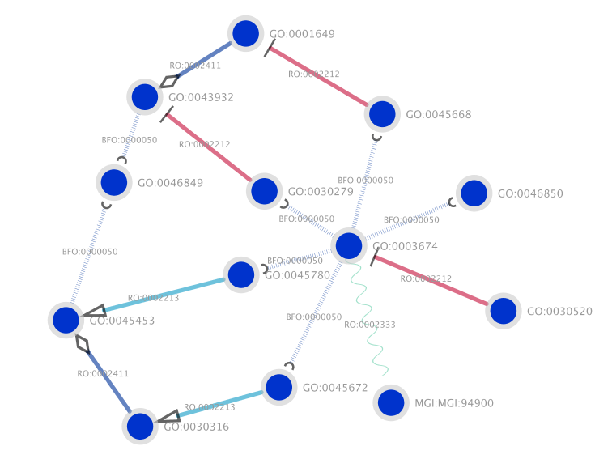

# GOCAM export to SIF
Export GO-CAMs to SIF in Python

## Usage
```
python ttl2sif.py -i <input:directory> [-o <output:directory> -a <output:archive> -l -d]
```

### Example
```
python ttl2sif.py -i /data/noctua-models/models/ -a gocam-sif.zip -l -d
```

### Parameters
* `i`: input directory containing GO-CAM TTL files
* `o`: output directory to save the GO-CAM SIF files
* `a`: zip filename to store all the GO-CAM SIF files
* `l`: when specified, try to convert URIs in human readable labels
* `d`: when specified, if a given entity (e.g. GO term) has multiple instances, the entity name will also be duplicated _2, _3, etc, so that it appears as different nodes in the SIF format
* `g`: when specified, only extract basic Gene Product - Gene Product relationships from the GO-CAMs

## SIF files
* Documentation about the [SIF Format](http://manual.cytoscape.org/en/stable/Supported_Network_File_Formats.html)
* SIF files can be viewed with [Cytoscape](https://cytoscape.org)
* They can also be exported with Cytoscape as a web application as in the [cytocam example](http://cytocam.geneontology.cloud)

### View SIF in Cytoscape
We advise using our [styling](#) in Cytoscape for a better rendering of the GO-CAM graphs.

### CURIEs vs Labels
In the following example, the `-l` parameter was used trying to show the labels of each entity:


And without the `l` parameter:


### Multiple vs single instance of an entity
In the following example, the `-d` parameter was used, hence the two instances of the gene `Pear1 Mmus` appears as two separate nodes:


Whereas in this same example, all instances of a same entity (e.g. `Pear 1 Mmus`) have been merged in a single node:


### Gene Product - Gene Product relationships
When specifying the `g` parameter, the original GO-CAM graph:


will be simplified in:


## Additional Notes
* GO-CAM TTL files made from [Noctua](http://noctua.geneontology.org) can be retrieved here: [https://github.com/geneontology/noctua-models/tree/master/models](https://github.com/geneontology/noctua-models/tree/master/models).
* Other GO-CAM TTL files can be retrieved from the Gene Ontology [current release](http://current.geneontology.org/products/ttl/index.html)
